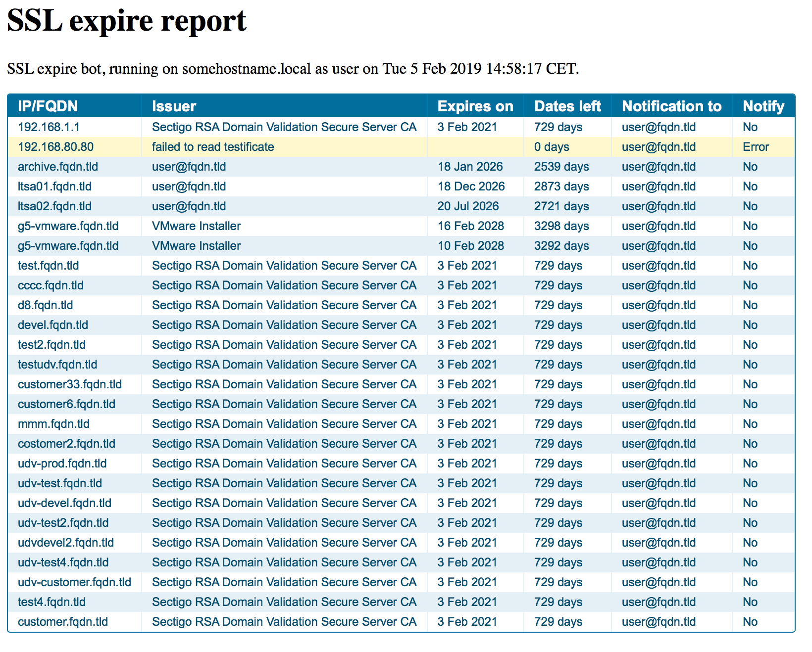

# Readme

Quick and dirty test if ssl certs are about to expire. The bash script requires _GNU date_ and is tested on OSX, Linux and OpenBSD. 

The report looks this way



## Installation

Should work directly on most Linux distributions including cygwin, while OSX and OpenBSD will have to install GNU date first (brew and pkg).

Please check and change RCPT, SENDERADDR and PATH vars at the top of the script.

Move `check_cert_expires.sh` some where i.e `/usr/local/bin` and create i.e. `/usr/local/etc/list.txt` based on `list.txt.example`.

Run periodically as `/usr/local/bin/check_cert_expires.sh -l /usr/local/etc/list.txt -r you@mail.address` 

`````
echo '59      07 * * * root [ -x /usr/local/bin/check_cert_expires.sh ] && /usr/local/bin/check_cert_expires.sh -f /usr/local/etc/list.txt -r thomas@haugaard.net' > /etc/cron.d/check_ssl'
chmod 555 /usr/local/bin/check_cert_expires.sh
chmod 460 /etc/cron.d/check_ssl
chown root:root /etc/cron.d/check_ssl
service cron restart
`````

The file `list.txt` contains tree columns __server__ __responsible_email__  __days_left_warning__

The __server__ (fqdn or address) must be reachable while __responsible_email__ is just for information on who should be contacted and __days_left_warning__ is when the warning should be triggered.

## License

[Modified BSD License](./LICENSE)
